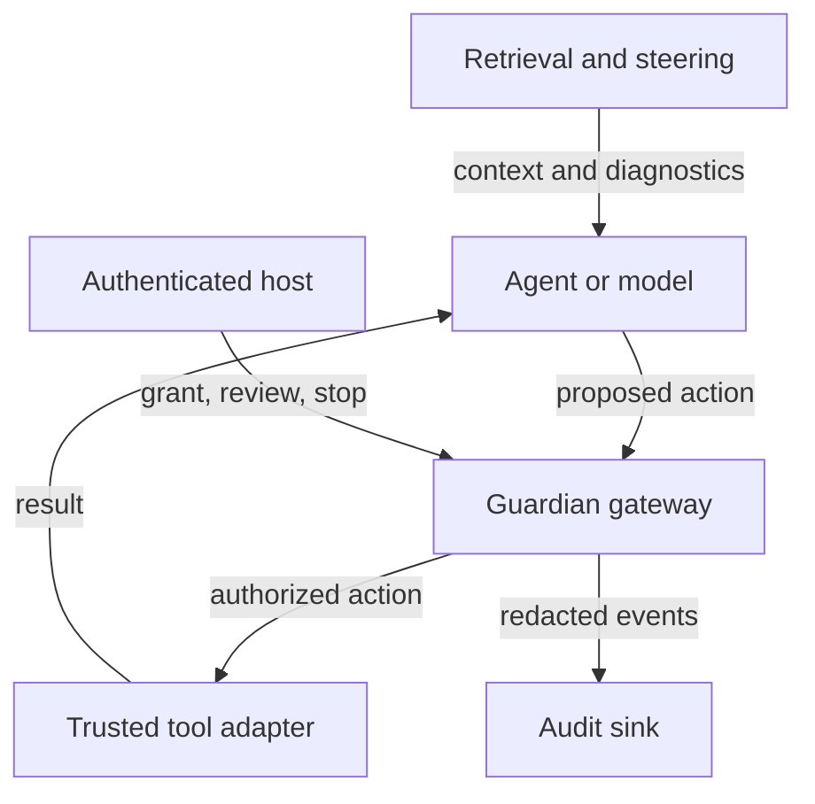

# Architecture and trust boundary

[README](../README.md) · [Guardian integration](guardian_integration.md) ·
[Steering guide](steering_guide.md) · [Testing](testing.md)

Machine-POI has two independent paths. The research path produces text and
measurements. The guardian path authorizes structured tool proposals inside a
trusted host. Importing or running the research path does not install a tool
boundary around an agent.

## Authority and data flow

The host authenticates the operator and agent channel, owns credentials and the
tool registry, and prevents direct access to protected services. Those are
requirements on the deployment, not features supplied by the diagram or library.
An agent-controlled process must not be able to call host control methods or
replace policy, adapter, grant or audit objects.

| Input | Authority |
| --- | --- |
| Authenticated host grant | Defines exact scopes, expiry, budgets and policy version |
| Agent's proposed action | Requests one registered tool with immutable JSON arguments |
| Trusted adapter's resolved scope | Identifies affected resources, destinations, data classes and upper-bound costs |
| Operator approval | Authorizes the stored pending action within the existing grant |
| Retrieved text, model output, diagnostic score | Can inform investigation; cannot broaden a grant |

The grant's `goal` is descriptive. Current policy checks structured scope and
budgets; it does not infer whether arbitrary content advances that goal. Adapters
must derive data classification and recipients from real host context. Scope
labels supplied by the model are insufficient.

The separation between model-generated proposals and host-controlled authority is related to [Out-of-Band Policy Enforcement at a Trusted Tool Boundary](https://arxiv.org/abs/2608.27646) and [Progent](https://arxiv.org/abs/2504.11703), which likewise place policy enforcement outside the model's unconstrained reasoning path. [CaMeL](https://arxiv.org/abs/2503.18813) similarly separates trusted control information from untrusted data. Machine-POI implements a narrower reference gateway: grants are host-issued, and the gateway rechecks structured proposals against those grants before execution.

## Guardian execution

1. `Gateway.issue` accepts a host-created `TaskGrant`. Run IDs cannot be reused in
   the gateway. Child grants must narrow scope/lifetime/budgets and reference an
   active parent.
2. `submit` receives a `ProposedAction` and caller identity supplied by the host's
   authenticated transport. Arguments are bounded, canonical JSON; `ToolSpec`
   rejects missing/extra fields and exact-type mismatches. Nested object meaning
   remains the adapter's responsibility.
3. The gateway checks identity, run/ancestor state, expiry, policy, tool scope,
   resources, destinations, data classes, attempts, replay and budgets under a
   lock. A hard violation stops the authenticated run and descendants. A wrong
   caller cannot stop another principal's run.
4. A sensitive in-scope action becomes a stored `PendingReview` and pauses the
   run. The operator sees its exact arguments and resolved scope. Approval checks
   its hash, expiry and current binding; it cannot substitute a new action body.
5. Before dispatch, the gateway logs the decision and reserves conservative
   action/cost/token amounts against the run and every ancestor. It re-resolves
   scope and checks authorization again after queueing, before adapter entry.
   A stop, expiry or scope/binding change blocks the queued action. A review
   that pauses the run concurrently does not: pausing holds new dispatch only.
6. The async adapter executes with an `ExecutionContext` deadline/cancellation
   checkpoint. It must check immediately before each effect and enforce service
   limits. The outcome is logged without raw arguments, results or exceptions.

The approval binding includes the action fingerprint, resolved scope, tool
version and grant policy version. The action includes the run ID. In-process
immutability and the host-only control interface are required; this binding is
not a signed authorization token for a remote service.

## State, concurrency and recovery

| State | Meaning |
| --- | --- |
| `RUNNING` | Proposals may be evaluated within the grant |
| `OBSERVE` | Host has recorded a weak risk signal; authority is unchanged |
| `PAUSED` | A pending action needs operator review; new dispatch is held, while actions dispatched before the pause may finish |
| `STOPPED` | The run cannot resume; new authorization requires fresh state |

`observe` only records an allowed host signal and can move RUNNING to OBSERVE.
There is no automatic drift classifier or escalation threshold. A review decision
causes PAUSED; policy violations or the host kill switch cause STOPPED.

One gateway owns one event loop and in-memory run/replay/budget state. It uses a
lock for atomic accounting and tracks tasks and cancellation contexts. Stopping
revokes descendants logically, cancels tasks cooperatively, and calls the host's
`on_stop` callback. A callback failure stops all local runs and makes the gateway
unavailable. Blocking code or already-committed remote effects require separate
host controls and reconciliation.

Audit events form a hash chain with a single writer. File-backed appends are
flushed and fsynced; audit failure closes the execution path. The chain is not
externally anchored, and loading it does not restore authorization state. Use
host-controlled durable state and service-side idempotency before deployment
across restarts or replicas. Details are in the [guardian guide](guardian_integration.md).

## Research execution

| Component | Responsibility |
| --- | --- |
| `QuranSteerer` | Prepare mean/persona vectors, calibrate ratio doses and orchestrate generation/retrieval |
| `ContrastiveQuranSteerer` | Construct vectors from positive and negative activation sets |
| `SteeredLLM` | Load a checkpoint, register decoder-layer output hooks, serialize model use |
| `QuranEmbeddings` | Load/chunk text and produce retrieval embeddings |
| `QuranKnowledgeBase` | ChromaDB retrieval at verse, passage and surah resolutions |
| `HybridQuranKnowledgeBase`, `QuranLightRAG` | Optional graph indexing/querying alongside vector retrieval |
| `GraphBridgeGenerator`, domain bridge helpers | Expand queries through static themes, graph relations or embedding similarity |
| `steering_cache`, `retrieval_context` | Validate numeric artifacts and quote/bound external context |
| `workspace_diagnostics`, `transport_stats` | Inspect interventions and summarize experimental comparisons |
| `evaluation`, `experiments/steering_eval.py` | Score steering conditions on held-out prompts with intervals and provenance ([evaluation guide](evaluation.md)) |

A high-level steerer serializes synchronous operations. A model wrapper separately
serializes inference and hook mutation. `generate` and graph generation use a
synchronous steering session that restores prior vectors, coefficients, modes
and enabled flags on exit. Graph retrieval finishes before that session; its lock
must not span an `await`. Re-registering a layer replaces its handle. Activation
extraction runs unsteered and removes temporary capture hooks in `finally`.

`last_run_diagnostics` retains scalar summaries after high-level generation;
hooks accumulate running statistics rather than copying hidden states. This is mutable per-instance
telemetry, not an immutable per-request audit record. Direct access to the wrapped
model or concurrent mutation outside these APIs bypasses the serialization
contract.

Graph provider calls and research storage are not automatically mediated by the
guardian. A host adopting those operations must include them in its tool inventory,
permission model and credential boundary.

## Frozen Quran-guidance experiments

`QuranGuidance` orchestrates the existing steerer, retrieval index and serialized
LLM hooks. It validates canonical reference text, prepares centered and paired
behavioral directions, fits a training-only low-rank rotor basis, and calibrates
achieved displacement on development tasks. Retrieval and sentence embeddings
cannot modify the frozen intervention or host authority. `guidance_evaluation`
parses model JSON and passes every proposed action through the reference gateway;
model telemetry, host decisions and mock effect receipts are separate records.

The [pipeline guide](quran_guidance.md) defines configuration, API/CLI routing,
held-out comparisons, provenance and metrics. The new rotor is opt-in G1 only;
model-native directions never contain external sentence-embedding coordinates.
A harmful action in an allowed scope remains a content-policy limitation.

## Implemented boundary and remaining work

The reference gateway and runtime repairs are implemented and tested with mocks.
Authentication, OS/network isolation, credential issuance, durable/shared state,
operator UI, incident delivery and real adapters are host responsibilities.
Held-out agent evaluations and staged deployment remain open in the
[containment plan](rogue_agent_containment_plan.md). Research diagnostics have no
validated threshold for deciding whether an agent is authorized or safe.
